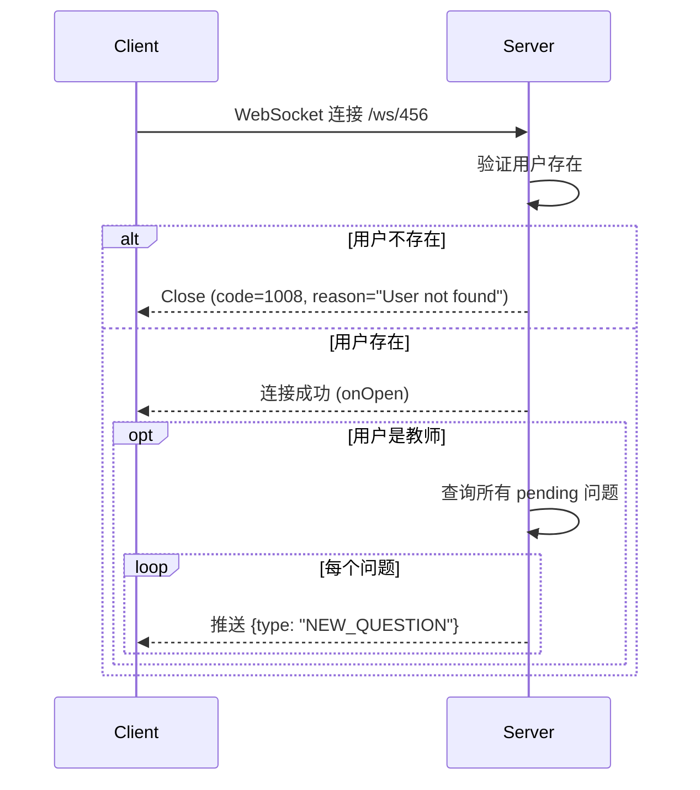

# AskNow API 参考文档

本文档详细说明 AskNow 后端 API 的所有接口，包括请求格式、响应格式、错误处理等。

## 目录

- [API 概览](#api-概览)
- [认证接口](#认证接口)
- [问题接口](#问题接口)
- [消息接口](#消息接口)
- [文件上传接口](#文件上传接口)
- [WebSocket 接口](#websocket-接口)
- [错误处理](#错误处理)

---

## API 概览

### Base URL

- **开发环境**（Android 模拟器）：`http://10.0.2.2:8000/`
- **生产环境**：`http://your-server-ip:8000/`

### 通用规范

#### 请求头

所有需要认证的接口都需要在请求头中携带 JWT Token：

```http
Authorization: Bearer <your_jwt_token>
```

#### 统一响应格式

```json
{
  "success": true,          // 操作是否成功
  "message": "操作描述",     // 提示信息
  "data": { /* 数据 */ },   // 具体数据（可选）
  "pagination": { /* 分页 */ }  // 分页信息（可选）
}
```

#### HTTP 状态码

| 状态码 | 说明 |
|--------|------|
| 200 | 请求成功 |
| 201 | 创建成功 |
| 400 | 请求参数错误 |
| 401 | 未授权（Token 无效或过期）|
| 403 | 禁止访问（权限不足）|
| 404 | 资源不存在 |
| 500 | 服务器内部错误 |

#### 时间戳格式

所有时间戳均使用**毫秒级** Unix 时间戳（13 位数字）。

```javascript
// JavaScript 示例
const timestamp = Date.now();  // 1234567890000

// Java 示例
long timestamp = System.currentTimeMillis();  // 1234567890000

// Python 示例
import time
timestamp = int(time.time() * 1000)  # 1234567890000
```

---

## 认证接口

### 1. 用户注册

创建新用户账号。

**请求：**

```http
POST /api/register
Content-Type: application/json

{
  "username": "string",     // 用户名（必填）
  "password": "string",     // 密码（必填）
  "role": "student"         // 角色：student 或 tutor（必填）
}
```

**响应示例（成功）：**

```json
{
  "success": true,
  "message": "Registration successful",
  "token": "eyJhbGciOiJIUzI1NiIsInR5cCI6IkpXVCJ9...",
  "user": {
    "id": 123,
    "username": "student001",
    "role": "student"
  }
}
```

**响应示例（用户名已存在）：**

```json
{
  "success": false,
  "message": "Username already exists"
}
```

**字段说明：**

- `username`: 用户名，需唯一
- `password`: 明文密码，服务器会使用 bcrypt 加密存储
- `role`: 用户角色
  - `student`: 学生（可以提问）
  - `tutor`: 教师（可以回答问题）
- `token`: JWT 访问令牌，有效期 7 天

### 2. 用户登录

使用用户名和密码登录。

**请求：**

```http
POST /api/login
Content-Type: application/json

{
  "username": "string",     // 用户名
  "password": "string"      // 密码
}
```

**响应示例（成功）：**

```json
{
  "success": true,
  "message": "Login successful",
  "token": "eyJhbGciOiJIUzI1NiIsInR5cCI6IkpXVCJ9...",
  "user": {
    "id": 123,
    "username": "student001",
    "role": "student"
  }
}
```

**响应示例（失败）：**

```json
{
  "success": false,
  "message": "Invalid username or password"
}
```

---

## 问题接口

### 1. 获取问题列表

获取问题列表，支持分页和状态过滤。

**请求：**

```http
GET /api/questions?status={status}&page={page}&page_size={page_size}
Authorization: Bearer <token>
```

**查询参数：**

| 参数 | 类型 | 必填 | 说明 |
|------|------|------|------|
| status | string | 否 | 问题状态：`pending`, `in_progress`, `closed` |
| page | integer | 否 | 页码，从 1 开始（默认：1）|
| page_size | integer | 否 | 每页数量，1-100（默认：20）|

**权限说明：**

- **学生**：
  - 不传 `status` 时，返回自己创建的所有问题
  - 传 `status` 时，返回自己创建的指定状态的问题
- **教师**：
  - 不传 `status` 时，返回自己接受的所有问题（in_progress 和 closed）
  - `status=pending`：返回所有待接取的问题（问题广场）
  - `status=in_progress`：返回自己正在辅导的问题
  - `status=closed`：返回自己已完成的问题

**响应示例：**

```json
{
  "success": true,
  "questions": [
    {
      "id": 123,
      "userId": 456,
      "tutorId": 789,
      "content": "如何解这道数学题？2x + 5 = 15",
      "imagePaths": [
        "/uploads/456/1234567890.jpg",
        "/uploads/456/1234567891.jpg"
      ],
      "status": "in_progress",
      "createdAt": 1234567890000,
      "updatedAt": 1234567895000
    },
    {
      "id": 124,
      "userId": 456,
      "tutorId": null,
      "content": "这个英语单词怎么读？",
      "imagePaths": [],
      "status": "pending",
      "createdAt": 1234567900000,
      "updatedAt": 1234567900000
    }
  ],
  "pagination": {
    "page": 1,
    "pageSize": 20,
    "total": 45,
    "totalPages": 3
  }
}
```

**字段说明：**

- `id`: 问题唯一标识
- `userId`: 提问学生的 ID
- `tutorId`: 接受问题的教师 ID（pending 状态时为 null）
- `content`: 问题文字描述
- `imagePaths`: 问题图片路径数组（可能为空）
- `status`: 问题状态
  - `pending`: 待接取
  - `in_progress`: 进行中
  - `closed`: 已关闭
- `createdAt`: 创建时间（毫秒时间戳）
- `updatedAt`: 最后更新时间（毫秒时间戳）

### 2. 创建问题

学生创建新问题。

**请求：**

```http
POST /api/questions
Authorization: Bearer <token>
Content-Type: application/json

{
  "content": "string",                    // 问题内容（必填）
  "imagePaths": ["string", "string"]      // 图片路径数组（可选）
}
```

**请求示例：**

```json
{
  "content": "如何解这道数学题？2x + 5 = 15",
  "imagePaths": [
    "/uploads/456/1234567890.jpg",
    "/uploads/456/1234567891.jpg"
  ]
}
```

**响应示例：**

```json
{
  "success": true,
  "message": "Question created successfully",
  "question": {
    "id": 125,
    "userId": 456,
    "tutorId": null,
    "content": "如何解这道数学题？2x + 5 = 15",
    "imagePaths": [
      "/uploads/456/1234567890.jpg",
      "/uploads/456/1234567891.jpg"
    ],
    "status": "pending",
    "createdAt": 1234567920000,
    "updatedAt": 1234567920000
  }
}
```

**注意事项：**

1. 图片需要先通过 `/api/upload` 接口上传获取路径
2. 创建成功后，会通过 WebSocket 广播给所有在线教师
3. 只有学生角色可以创建问题

### 3. 接受问题

教师接受待解答的问题。

**请求：**

```http
POST /api/questions/accept
Authorization: Bearer <token>
Content-Type: application/json

{
  "questionId": 123      // 问题 ID（必填）
}
```

**响应示例（成功）：**

```json
{
  "success": true,
  "message": "Question accepted",
  "question": {
    "id": 123,
    "userId": 456,
    "tutorId": 789,
    "status": "in_progress",
    "updatedAt": 1234567930000
  }
}
```

**错误响应示例：**

```json
// 权限不足（非教师）
{
  "detail": "Only tutors can accept questions"
}

// 问题不存在
{
  "detail": "Question not found"
}

// 问题状态不是 pending
{
  "detail": "Question is not pending"
}
```

**注意事项：**

1. 只有教师角色可以接受问题
2. 只能接受状态为 `pending` 的问题
3. 接受成功后：
   - 问题状态变为 `in_progress`
   - 设置 `tutorId` 为当前教师
   - 通过 WebSocket 通知学生和所有教师

### 4. 关闭问题

关闭问题，结束辅导。

**请求：**

```http
POST /api/questions/close
Authorization: Bearer <token>
Content-Type: application/json

{
  "questionId": 123      // 问题 ID（必填）
}
```

**响应示例：**

```json
{
  "success": true,
  "message": "Question closed",
  "question": {
    "id": 123,
    "status": "closed",
    "updatedAt": 1234567940000
  }
}
```

**权限说明：**

- 问题的创建者（学生）可以关闭
- 问题的接受者（教师）可以关闭
- 其他人无权关闭

**注意事项：**

1. 关闭后问题状态变为 `closed`
2. 聊天记录保留但不能继续发送消息
3. 通过 WebSocket 通知相关用户

---

## 消息接口

### 1. 获取消息列表

获取指定问题的聊天消息列表。

**请求：**

```http
GET /api/messages?questionId={questionId}&page={page}&page_size={page_size}
Authorization: Bearer <token>
```

**查询参数：**

| 参数 | 类型 | 必填 | 说明 |
|------|------|------|------|
| questionId | integer | 是 | 问题 ID |
| page | integer | 否 | 页码，从 1 开始（默认：1）|
| page_size | integer | 否 | 每页数量，1-200（默认：50）|

**响应示例：**

```json
{
  "success": true,
  "messages": [
    {
      "id": 1001,
      "questionId": 123,
      "senderId": 456,
      "content": "这道题我不太会做，能帮我讲解一下吗？",
      "messageType": "text",
      "createdAt": 1234567890000,
      "isRead": true
    },
    {
      "id": 1002,
      "questionId": 123,
      "senderId": 789,
      "content": "好的，我来帮你分析一下这道题",
      "messageType": "text",
      "createdAt": 1234567895000,
      "isRead": true
    },
    {
      "id": 1003,
      "questionId": 123,
      "senderId": 789,
      "content": "/uploads/789/1234567896.jpg",
      "messageType": "image",
      "createdAt": 1234567896000,
      "isRead": false
    }
  ],
  "pagination": {
    "page": 1,
    "pageSize": 50,
    "total": 23,
    "totalPages": 1
  }
}
```

**字段说明：**

- `id`: 消息唯一标识
- `questionId`: 所属问题 ID
- `senderId`: 发送者用户 ID
- `content`: 消息内容
  - 文本消息：文字内容
  - 图片消息：图片路径
- `messageType`: 消息类型
  - `text`: 文本消息
  - `image`: 图片消息
- `createdAt`: 发送时间（毫秒时间戳）
- `isRead`: 是否已读（接收方视角）

**权限说明：**

只有问题的创建者（学生）或接受者（教师）可以查看消息列表。

### 2. 发送消息

发送文字或图片消息。

**请求：**

```http
POST /api/messages
Authorization: Bearer <token>
Content-Type: application/json

{
  "questionId": 123,              // 问题 ID（必填）
  "content": "string",            // 消息内容（必填）
  "messageType": "text"           // 消息类型（默认：text）
}
```

**请求示例（文本消息）：**

```json
{
  "questionId": 123,
  "content": "首先，我们需要把方程两边同时减去 5",
  "messageType": "text"
}
```

**请求示例（图片消息）：**

```json
{
  "questionId": 123,
  "content": "/uploads/789/1234567900.jpg",
  "messageType": "image"
}
```

**响应示例：**

```json
{
  "success": true,
  "message": "Message sent successfully",
  "data": {
    "id": 1004,
    "questionId": 123,
    "senderId": 789,
    "content": "首先，我们需要把方程两边同时减去 5",
    "messageType": "text",
    "createdAt": 1234567905000,
    "isRead": false
  }
}
```

**注意事项：**

1. 图片需要先通过 `/api/upload` 接口上传
2. 发送成功后会通过 WebSocket 实时推送给接收方
3. 会更新问题的 `updatedAt` 时间

### 3. 标记消息已读

标记指定问题的所有未读消息为已读。

**请求：**

```http
POST /api/messages/mark-read
Authorization: Bearer <token>
Content-Type: application/json

{
  "questionId": 123      // 问题 ID（必填）
}
```

**响应示例：**

```json
{
  "success": true,
  "message": "Messages marked as read",
  "count": 5    // 标记为已读的消息数量
}
```

**注意事项：**

1. 只标记对方发送的消息（不标记自己发送的）
2. 只标记未读的消息（`isRead = false`）
3. 只有问题的创建者或接受者可以标记

---

## 文件上传接口

### 1. 上传图片

上传图片文件，用于问题或消息。

**请求：**

```http
POST /api/upload
Authorization: Bearer <token>
Content-Type: multipart/form-data

image: <file>
```

**使用示例（curl）：**

```bash
curl -X POST http://localhost:8000/api/upload \
  -H "Authorization: Bearer your_token_here" \
  -F "image=@/path/to/image.jpg"
```

**使用示例（Android/Retrofit）：**

```java
// 创建 MultipartBody.Part
File file = new File(imagePath);
RequestBody requestFile = RequestBody.create(
    MediaType.parse("image/jpeg"), 
    file
);
MultipartBody.Part body = MultipartBody.Part.createFormData(
    "image", 
    file.getName(), 
    requestFile
);

// 调用 API
Call<UploadResponse> call = apiService.uploadImage(
    "Bearer " + token, 
    body
);
```

**响应示例（成功）：**

```json
{
  "success": true,
  "message": "Image uploaded successfully",
  "imagePath": "/uploads/456/1234567890.jpg"
}
```

**文件限制：**

| 限制项 | 说明 |
|--------|------|
| 文件类型 | 仅支持图片（image/*）|
| 允许的扩展名 | .jpg, .jpeg, .png, .webp |
| 最大文件大小 | 10 MB |
| 文件名 | 自动生成为时间戳 + 扩展名 |

**错误响应示例：**

```json
// 文件类型不支持
{
  "detail": "Invalid file type: application/pdf. Only image files are allowed."
}

// 文件太大
{
  "detail": "File too large. Max size: 10.0MB"
}

// 文件扩展名不允许
{
  "detail": "Invalid file extension. Allowed: .jpg, .jpeg, .png, .webp"
}
```

**存储结构：**

```
uploads/
└── {user_id}/
    ├── 1234567890.jpg
    ├── 1234567891.jpg
    └── 1234567892.png
```

### 2. 获取图片

获取已上传的图片文件。

**请求：**

```http
GET /uploads/{user_id}/{filename}
```

**示例：**

```
GET /uploads/456/1234567890.jpg
```

**响应：**

- 成功：返回图片文件（FileResponse）
- 失败：返回 404 Not Found

**注意事项：**

1. 此接口**不需要**认证，任何人都可以访问
2. 文件名必须安全（不能包含 `..`, `/`, `\`）
3. 只能访问允许的文件类型

**Android 端图片加载示例（Glide）：**

```java
String imageUrl = BuildConfig.BASE_URL.replace("/", "") + imagePath;

Glide.with(context)
    .load(imageUrl)
    .placeholder(R.drawable.placeholder)
    .error(R.drawable.error)
    .into(imageView);
```

---

## WebSocket 接口

### 1. 建立 WebSocket 连接

用于接收实时消息推送。

**连接 URL：**

```
WS /ws/{user_id}
```

**示例：**

```
ws://10.0.2.2:8000/ws/456
```

**连接流程：**



**Android 端连接示例：**

```java
OkHttpClient client = new OkHttpClient.Builder()
    .pingInterval(30, TimeUnit.SECONDS)  // 心跳
    .build();

String url = "ws://10.0.2.2:8000/ws/" + userId;
Request request = new Request.Builder()
    .url(url)
    .build();

WebSocket webSocket = client.newWebSocket(request, new WebSocketListener() {
    @Override
    public void onOpen(WebSocket webSocket, Response response) {
        Log.d(TAG, "WebSocket connected");
    }
    
    @Override
    public void onMessage(WebSocket webSocket, String text) {
        // 处理接收到的消息
        WebSocketMessage message = gson.fromJson(text, WebSocketMessage.class);
        handleMessage(message);
    }
    
    @Override
    public void onFailure(WebSocket webSocket, Throwable t, Response response) {
        Log.e(TAG, "WebSocket error", t);
        // 自动重连
    }
});
```

### 2. 消息类型

#### 2.1 NEW_QUESTION - 新问题通知

**发送方**：服务器 → 教师

**触发时机**：学生创建新问题时

**消息格式：**

```json
{
  "type": "NEW_QUESTION",
  "data": {
    "id": 125,
    "userId": 456,
    "tutorId": null,
    "content": "如何解这道数学题？",
    "imagePaths": ["/uploads/456/1234567890.jpg"],
    "status": "pending",
    "createdAt": 1234567920000,
    "updatedAt": 1234567920000
  },
  "timestamp": "1234567920000"
}
```

**客户端处理：**

1. 解析问题数据
2. 插入到本地数据库
3. 更新"问题广场"列表 UI
4. 可选：显示通知

#### 2.2 CHAT_MESSAGE - 聊天消息

**发送方**：服务器 → 接收方

**触发时机**：对方发送消息时

**消息格式：**

```json
{
  "type": "CHAT_MESSAGE",
  "data": {
    "id": 1005,
    "questionId": 123,
    "senderId": 789,
    "content": "这道题的解法是...",
    "messageType": "text",
    "createdAt": 1234567930000,
    "isRead": false
  },
  "timestamp": "1234567930000"
}
```

**客户端处理：**

1. 解析消息数据
2. 插入到本地数据库
3. 更新聊天界面 UI
4. 如果不在聊天界面，显示未读消息通知

#### 2.3 QUESTION_UPDATED - 问题状态更新

**发送方**：服务器 → 相关用户

**触发时机**：
- 教师接受问题
- 任何人关闭问题

**消息格式：**

```json
{
  "type": "QUESTION_UPDATED",
  "data": {
    "id": 123,
    "userId": 456,
    "tutorId": 789,
    "status": "in_progress",
    "updatedAt": 1234567935000
  },
  "timestamp": "1234567935000"
}
```

**客户端处理：**

1. 解析问题更新
2. 更新本地数据库中的问题状态
3. 更新问题列表 UI
4. 如果状态变为 `in_progress`，学生端显示通知"教师已接受"

#### 2.4 ACK - 消息确认

**发送方**：服务器 → 客户端

**触发时机**：服务器收到客户端消息时

**消息格式：**

```json
{
  "type": "ACK",
  "messageId": "550e8400-e29b-41d4-a716-446655440000",
  "timestamp": "1234567940000"
}
```

**客户端处理：**

1. 根据 `messageId` 找到对应的待确认消息
2. 标记消息已送达
3. 可选：更新 UI 显示（如"已送达"标识）

### 3. 心跳机制

**OkHttp WebSocket** 自动实现 WebSocket 协议层的 ping/pong 帧：

```java
OkHttpClient client = new OkHttpClient.Builder()
    .pingInterval(30, TimeUnit.SECONDS)  // 每 30 秒自动发送 ping
    .build();
```

**作用：**
1. 保持连接活跃
2. 检测僵尸连接
3. 无需应用层实现额外的心跳

### 4. 自动重连

**重连策略（指数退避）：**

```java
private static final int[] BACKOFF_DELAYS = {1000, 2000, 4000, 8000, 16000};
private static final int MAX_RETRY_COUNT = 5;

private void reconnect() {
    if (retryCount >= MAX_RETRY_COUNT) {
        Log.e(TAG, "Max retry count reached, giving up");
        return;
    }
    
    int delay = BACKOFF_DELAYS[Math.min(retryCount, BACKOFF_DELAYS.length - 1)];
    
    reconnectThread = new Thread(() -> {
        try {
            Thread.sleep(delay);
            if (!isManuallyDisconnected) {
                connect();
                retryCount++;
            }
        } catch (InterruptedException e) {
            // 重连被中断
        }
    });
    
    reconnectThread.start();
}
```

**重连时机：**
- 网络断开（onFailure）
- 连接关闭（onClosed，非手动断开）
- 不重连：手动登出时

---

## 错误处理

### HTTP 错误响应

当 API 调用失败时，返回标准的错误响应：

```json
{
  "detail": "错误描述"
}
```

或者自定义格式：

```json
{
  "success": false,
  "message": "错误描述"
}
```

### 常见错误及处理

#### 1. 认证错误（401）

**错误信息：**
```json
{
  "detail": "Invalid or expired token"
}
```

**客户端处理：**
1. 清除本地 Token
2. 跳转到登录界面
3. 提示用户重新登录

#### 2. 权限不足（403）

**错误信息：**
```json
{
  "detail": "Only tutors can accept questions"
}
```

**客户端处理：**
1. 显示错误提示
2. 阻止该操作

#### 3. 资源不存在（404）

**错误信息：**
```json
{
  "detail": "Question not found"
}
```

**客户端处理：**
1. 显示"资源不存在"提示
2. 从本地数据库删除该资源（如果有）
3. 更新 UI

#### 4. 参数错误（400）

**错误信息：**
```json
{
  "detail": "Invalid file extension. Allowed: .jpg, .jpeg, .png, .webp"
}
```

**客户端处理：**
1. 显示具体的错误信息
2. 引导用户修正输入

#### 5. 服务器错误（500）

**错误信息：**
```json
{
  "detail": "Failed to create question"
}
```

**客户端处理：**
1. 显示"服务器错误，请稍后重试"
2. 记录错误日志
3. 可选：自动重试（如果是临时性错误）

### 网络错误处理

**连接超时：**
```java
try {
    response = call.execute();
} catch (SocketTimeoutException e) {
    // 提示用户网络超时
    showError("网络连接超时，请检查网络后重试");
} catch (IOException e) {
    // 网络不可用
    showError("网络连接失败，请检查网络设置");
}
```

**离线处理：**
1. 检测网络状态
2. 离线时使用本地数据库数据
3. 显示"离线模式"提示
4. 网络恢复后自动同步

### 错误码汇总

| HTTP 状态码 | 错误信息 | 说明 |
|-------------|---------|------|
| 401 | Invalid authorization header | Authorization 头格式错误 |
| 401 | Invalid or expired token | Token 无效或已过期 |
| 401 | User not found | Token 对应的用户不存在 |
| 403 | Only tutors can accept questions | 只有教师可以接受问题 |
| 403 | You are not assigned to this question | 你不是该问题的接受者 |
| 403 | You can only close your own questions | 你只能关闭自己的问题 |
| 403 | No permission to view these messages | 无权查看这些消息 |
| 404 | Question not found | 问题不存在 |
| 404 | Image not found | 图片不存在 |
| 400 | Question is not pending | 问题状态不是 pending |
| 400 | Invalid file type | 文件类型不支持 |
| 400 | File too large | 文件太大 |
| 400 | Invalid file extension | 文件扩展名不允许 |
| 400 | Invalid filename | 文件名不安全 |
| 500 | Registration failed | 注册失败（服务器错误）|
| 500 | Login failed | 登录失败（服务器错误）|
| 500 | Failed to fetch questions | 获取问题列表失败 |
| 500 | Failed to create question | 创建问题失败 |
| 500 | Failed to send message | 发送消息失败 |
| 500 | Failed to upload image | 上传图片失败 |

---

## 完整使用流程示例

### 学生端完整流程

```
1. 注册/登录
   POST /api/register 或 POST /api/login
   ↓
   获取 Token 和用户信息
   ↓
2. 建立 WebSocket 连接
   WS /ws/{user_id}
   ↓
3. 提问
   3.1 上传图片（如果有）
       POST /api/upload (可多次)
       ↓
       获取图片路径列表
   3.2 创建问题
       POST /api/questions
       ↓
       问题创建成功
   ↓
4. 等待教师接受
   ← WebSocket: QUESTION_UPDATED (status=in_progress)
   ↓
5. 聊天
   5.1 查看历史消息
       GET /api/messages?questionId={id}
   5.2 发送消息
       POST /api/messages
   5.3 接收消息
       ← WebSocket: CHAT_MESSAGE
   5.4 标记已读
       POST /api/messages/mark-read
   ↓
6. 结束辅导
   POST /api/questions/close
```

### 教师端完整流程

```
1. 注册/登录
   POST /api/register 或 POST /api/login
   ↓
   获取 Token 和用户信息
   ↓
2. 建立 WebSocket 连接
   WS /ws/{user_id}
   ↓
   ← WebSocket: 推送所有 pending 问题
   ↓
3. 查看问题广场
   GET /api/questions?status=pending
   ← WebSocket: NEW_QUESTION (实时新问题)
   ↓
4. 接受问题
   POST /api/questions/accept
   ↓
5. 聊天辅导
   5.1 查看历史消息
       GET /api/messages?questionId={id}
   5.2 发送消息
       POST /api/messages
   5.3 接收消息
       ← WebSocket: CHAT_MESSAGE
   5.4 标记已读
       POST /api/messages/mark-read
   ↓
6. 完成辅导
   POST /api/questions/close
```

---

## API 测试

### 使用 Postman 测试

1. **设置环境变量**
   - `base_url`: `http://localhost:8000`
   - `token`: 登录后获取的 JWT Token

2. **注册用户**
   ```
   POST {{base_url}}/api/register
   Body: {"username": "student001", "password": "123456", "role": "student"}
   ```

3. **登录获取 Token**
   ```
   POST {{base_url}}/api/login
   Body: {"username": "student001", "password": "123456"}
   
   保存返回的 token 到环境变量
   ```

4. **调用需要认证的 API**
   ```
   GET {{base_url}}/api/questions
   Header: Authorization: Bearer {{token}}
   ```

### 使用 Python 测试脚本

项目提供了完整的测试脚本：

```bash
cd backend
python test_api.py
```

测试脚本会：
1. 注册学生和教师账号
2. 测试所有 API 端点
3. 测试 WebSocket 连接
4. 测试完整的业务流程
5. 输出彩色测试报告

---

## 性能和限制

### 请求限制

| 项目 | 限制 |
|------|------|
| 文件上传大小 | 10 MB |
| 问题列表分页 | 最多 100 条/页 |
| 消息列表分页 | 最多 200 条/页 |
| Token 有效期 | 7 天 |
| WebSocket 心跳间隔 | 30 秒 |

### 性能建议

1. **分页加载**：使用分页避免一次性加载大量数据
2. **本地缓存**：使用 Room 数据库缓存数据
3. **图片压缩**：上传前压缩图片到合适大小
4. **连接复用**：使用 OkHttp 连接池
5. **请求合并**：合并多个相关请求

---

## 相关文档

- [技术架构详解](ARCHITECTURE.md)
- [开发指南](DEVELOPMENT_GUIDE.md)
- [部署指南](DEPLOYMENT.md)

---

## 更新日志

### v1.0.0 (2025)
- 初始版本
- 完整的认证、问题、消息、文件上传 API
- WebSocket 实时通信
- 分页支持
- 消息已读功能

