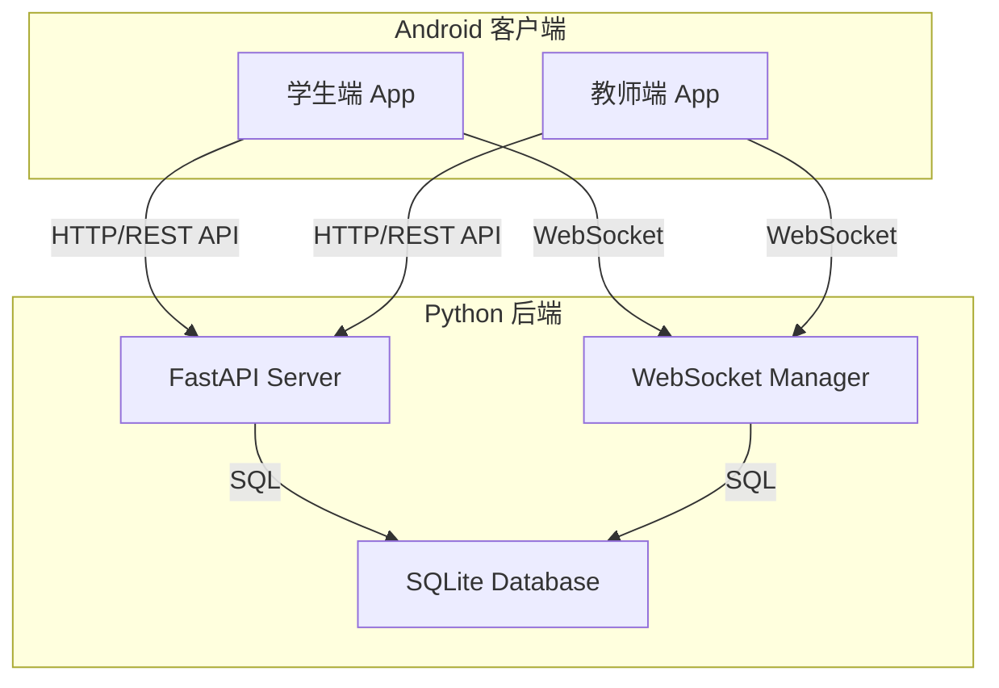
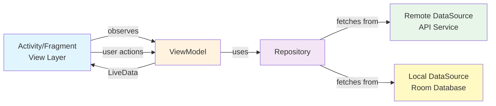
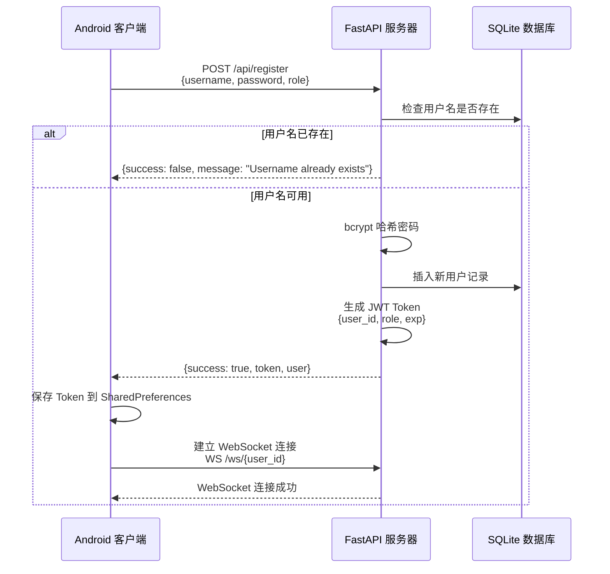
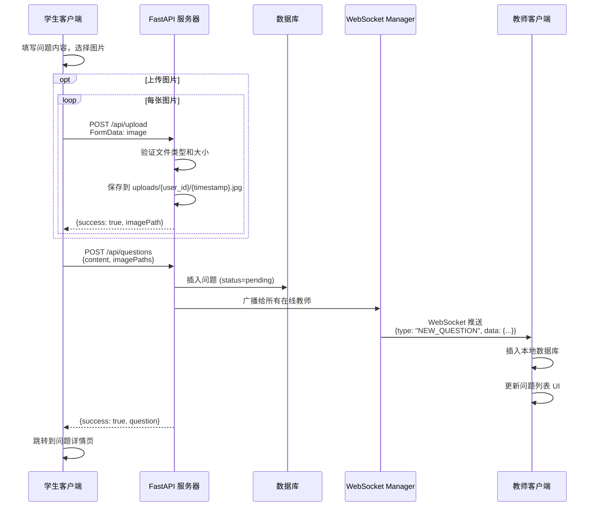
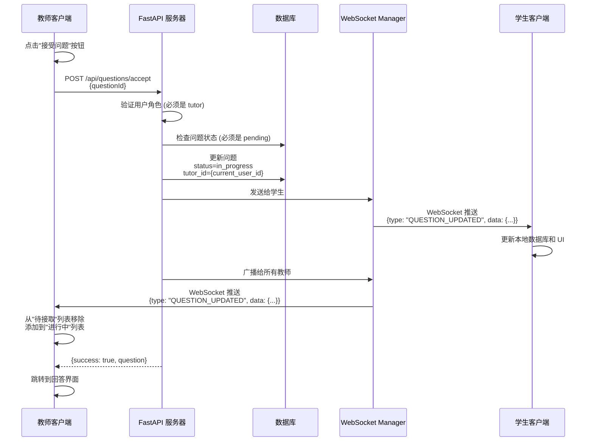
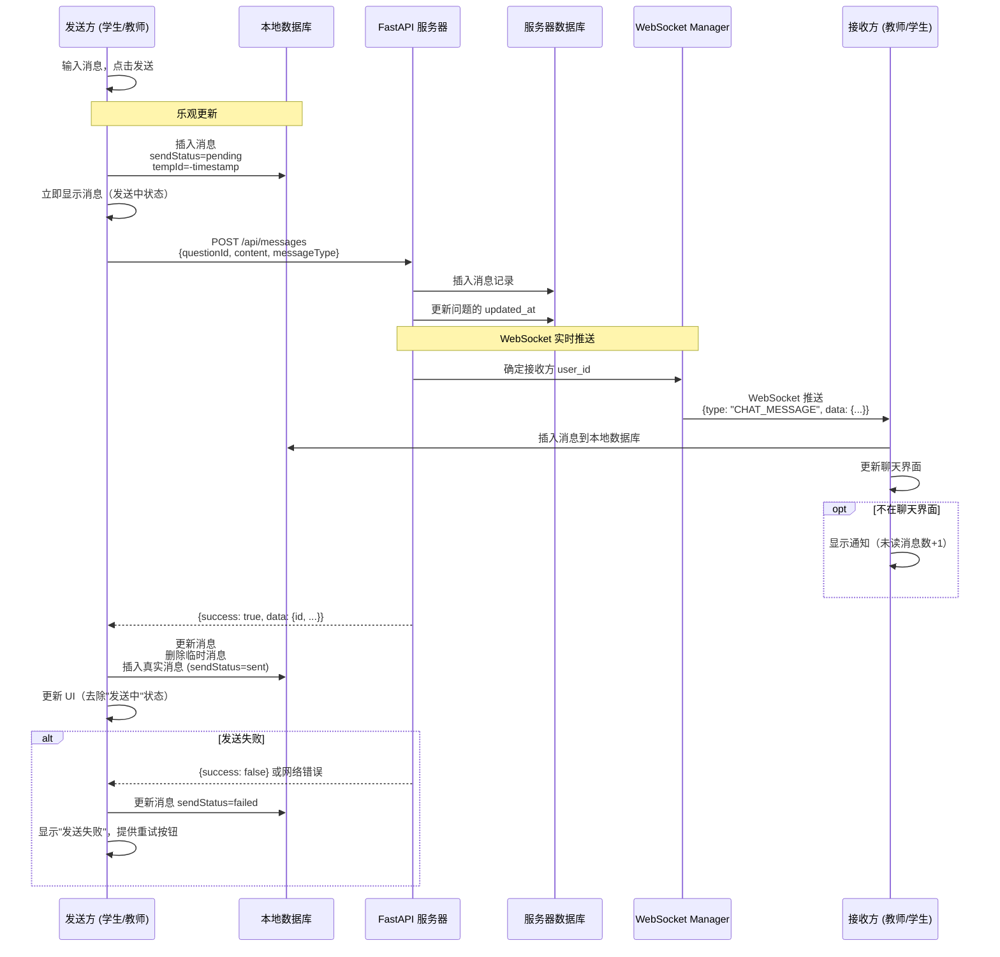
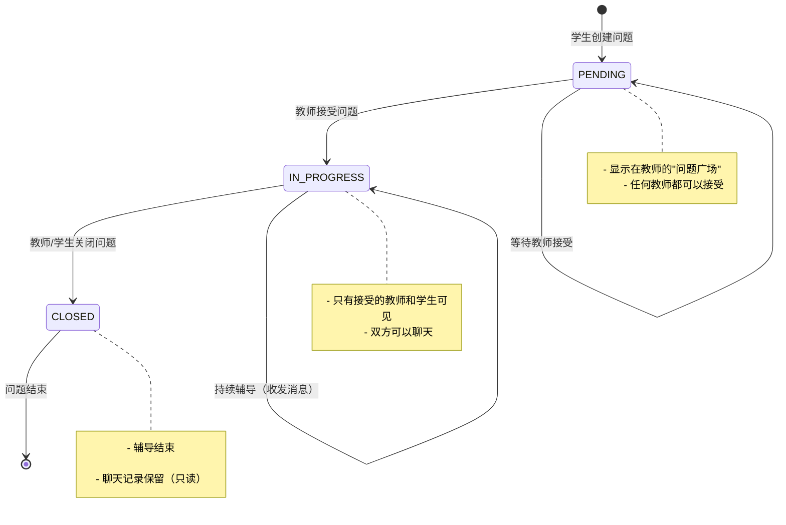
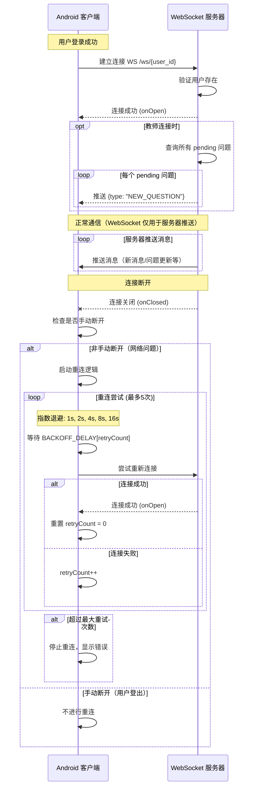
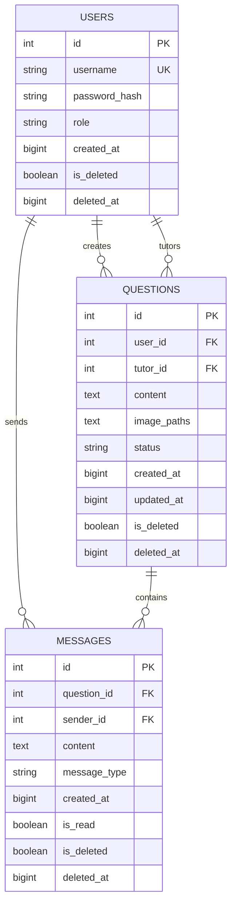

# AskNow 技术架构详解

本文档详细介绍 AskNow 实时问答辅导系统的技术架构、设计模式和核心组件。

## 目录

- [系统概览](#系统概览)
- [Android 客户端架构](#android-客户端架构)
- [Python 后端架构](#python-后端架构)
- [系统交互流程](#系统交互流程)
- [数据模型](#数据模型)
- [通信协议](#通信协议)

---

## 系统概览

AskNow 采用 **客户端-服务器架构**，包含三个核心组件：



### 技术栈总览

| 层级 | Android 端 | 后端 |
|------|-----------|------|
| **开发语言** | Java | Python 3.8+ |
| **架构模式** | MVVM | RESTful + WebSocket |
| **网络层** | Retrofit + OkHttp | FastAPI + uvicorn |
| **数据库** | Room (SQLite) | SQLAlchemy (async SQLite) |
| **依赖注入** | Hilt (Dagger) | - |
| **实时推送** | WebSocket 接收 (OkHttp) | WebSocket 推送 (FastAPI) |
| **认证** | JWT Token | JWT (PyJWT) + bcrypt |
| **UI 框架** | Material Design 3 | - |

---

## Android 客户端架构

### MVVM 架构模式

AskNow Android 端采用 **MVVM (Model-View-ViewModel)** 架构，实现了清晰的关注点分离：



#### 1. View Layer (UI 层)

**Activity 和 Fragment**
- 负责 UI 渲染和用户交互
- 观察 ViewModel 的 LiveData
- 不包含业务逻辑
- 通过 Hilt 注入 ViewModel

**主要 Activity/Fragment：**
```
ui/
├── auth/
│   ├── LoginActivity.java           # 登录界面
│   └── RegisterActivity.java        # 注册界面
├── student/
│   ├── StudentMainActivity.java     # 学生主界面
│   ├── PublishQuestionActivity.java # 提问界面
│   └── QuestionDetailActivity.java  # 问题详情/聊天
├── tutor/
│   ├── TutorMainActivity.java       # 教师主界面
│   └── AnswerActivity.java          # 回答界面/聊天
└── image/
    └── ImagePreviewActivity.java    # 图片预览（支持缩放）
```

#### 2. ViewModel Layer

**职责：**
- 持有 UI 状态（LiveData）
- 处理用户交互逻辑
- 调用 Repository 获取数据
- **不持有** Activity/Fragment 引用（避免内存泄漏）

**核心 ViewModel：**

```java
// 基础 ViewModel - 提供线程池和错误处理
@HiltViewModel
public class BaseViewModel extends AndroidViewModel {
    protected final ExecutorService ioExecutor;      // IO 操作线程池
    protected final ExecutorService computeExecutor; // 计算密集型任务线程池
    
    // 统一的错误处理和 LiveData 更新机制
}

// 聊天 ViewModel - 继承自 BaseViewModel
@HiltViewModel
public class ChatViewModel extends BaseViewModel {
    private final ApiService apiService;
    private final MessageRepository messageRepository;
    private final QuestionDao questionDao;
    
    // 乐观更新：发送消息时立即显示
    public void sendTextMessage(long questionId, String content) {
        // 1. 立即插入本地数据库（status = pending）
        // 2. 发送 HTTP 请求
        // 3. 成功后更新状态为 sent，失败则标记 failed
    }
}

// 问题列表 ViewModel - 抽象基类
public abstract class BaseQuestionListViewModel extends BaseViewModel {
    // 公共逻辑：分页加载、下拉刷新、WebSocket 消息监听
}

// 学生端 ViewModel
@HiltViewModel
public class StudentViewModel extends BaseQuestionListViewModel {
    // 查看自己的问题列表
    // 创建新问题
}

// 教师端 ViewModel
@HiltViewModel
public class TutorViewModel extends BaseQuestionListViewModel {
    // 查看待接取问题（PENDING）
    // 查看进行中问题（IN_PROGRESS）
    // 查看已完成问题（CLOSED）
}
```

#### 3. Repository Layer (数据仓库层)

**职责：**
- 统一数据访问接口
- 决定从网络还是本地获取数据
- 数据同步和缓存策略
- 离线支持

**QuestionRepository：**
```java
@Singleton
public class QuestionRepository {
    private final ApiService apiService;
    private final QuestionDao questionDao;
    private final MessageDao messageDao;
    
    // 同步问题列表（支持分页）
    public void syncQuestionsFromServer(String token, long userId, String role, 
                                        int page, boolean isAppendMode, 
                                        SyncCallback callback) {
        // 1. 从服务器获取数据
        // 2. 更新本地数据库
        // 3. 在非追加模式下，清理本地不存在于服务器的数据
    }
    
    // 同步消息列表
    public void syncMessagesFromServer(String token, long questionId, 
                                       SyncCallback callback) {
        // 支持多页消息自动获取
    }
}
```

**MessageRepository：**
```java
@Singleton
public class MessageRepository {
    private final ApiService apiService;
    private final MessageDao messageDao;
    private final PendingMessageDao pendingMessageDao;
    private WebSocketClient webSocketClient;
    
    // 网络状态监听和自动重试机制
    private void registerNetworkCallback() {
        // 监听网络变化，网络恢复时自动发送待发送消息
    }
    
    // 未读消息计数
    public LiveData<Integer> getUnreadMessageCount(long questionId, long currentUserId) {
        return messageDao.getUnreadMessageCountLive(questionId, currentUserId);
    }
}
```

#### 4. Data Layer (数据层)

##### 4.1 Remote DataSource (网络数据源)

**ApiService (Retrofit 接口)：**
```java
public interface ApiService {
    // 认证
    @POST("api/register")
    Call<RegisterResponse> register(@Body RegisterRequest request);
    
    @POST("api/login")
    Call<LoginResponse> login(@Body LoginRequest request);
    
    // 问题
    @GET("api/questions")
    Call<QuestionsListResponse> getQuestions(
        @Header("Authorization") String token,
        @Query("status") String status,
        @Query("page") int page,
        @Query("page_size") int pageSize
    );
    
    @POST("api/questions")
    Call<QuestionResponse> createQuestion(
        @Header("Authorization") String token,
        @Body QuestionRequest request
    );
    
    // 消息
    @POST("api/messages")
    Call<MessageResponse> sendMessage(
        @Header("Authorization") String token,
        @Body MessageRequest request
    );
    
    // 文件上传
    @Multipart
    @POST("api/upload")
    Call<UploadResponse> uploadImage(
        @Header("Authorization") String token,
        @Part MultipartBody.Part image
    );
    
    // ... 其他接口
}
```

**WebSocket 客户端：**
```java
public class WebSocketClient {
    private WebSocket webSocket;
    private final OkHttpClient client;
    private final String url;
    private int retryCount = 0;
    
    // 自动重连机制（指数退避）
    private static final int[] BACKOFF_DELAYS = {1000, 2000, 4000, 8000, 16000};
    
    public void connect() {
        // 建立 WebSocket 连接
        // 设置消息监听器
    }
    
    private void reconnect() {
        // 指数退避重连策略
        // 最多重试 5 次
    }
}
```

##### 4.2 Local DataSource (本地数据源)

**Room 数据库架构：**
```
AppDatabase (version 8)
├── users (表)
├── questions (表)
│   ├── 索引：userId, status, tutorId, createdAt
│   └── 外键：userId → users.id, tutorId → users.id
└── messages (表)
    ├── 索引：questionId, senderId, createdAt
    ├── 外键：questionId → questions.id (CASCADE)
    └── 字段：isRead, sendStatus (v5, v6 添加)
```

**数据库迁移：**
```java
// Migration 4 → 5: 添加消息已读功能
static final Migration MIGRATION_4_5 = new Migration(4, 5) {
    @Override
    public void migrate(@NonNull SupportSQLiteDatabase database) {
        database.execSQL("ALTER TABLE messages ADD COLUMN isRead INTEGER NOT NULL DEFAULT 0");
    }
};

// Migration 5 → 6: 添加消息发送状态
static final Migration MIGRATION_5_6 = new Migration(5, 6) {
    @Override
    public void migrate(@NonNull SupportSQLiteDatabase database) {
        database.execSQL("ALTER TABLE messages ADD COLUMN sendStatus TEXT NOT NULL DEFAULT 'sent'");
    }
};

// Migration 7 → 8: 删除 pending_messages 表
// 原因：不再通过 WebSocket 发送消息，改用纯 HTTP API
static final Migration MIGRATION_7_8 = new Migration(7, 8) {
    @Override
    public void migrate(@NonNull SupportSQLiteDatabase database) {
        database.execSQL("DROP TABLE IF EXISTS pending_messages");
    }
};
```

**DAO 接口：**
```java
@Dao
public interface QuestionDao {
    @Insert(onConflict = OnConflictStrategy.REPLACE)
    long insert(QuestionEntity question);
    
    @Query("SELECT * FROM questions WHERE userId = :userId ORDER BY createdAt DESC")
    LiveData<List<QuestionEntity>> getQuestionsByUserId(long userId);
    
    @Query("SELECT * FROM questions WHERE status = :status ORDER BY createdAt ASC")
    LiveData<List<QuestionEntity>> getQuestionsByStatus(String status);
    
    @Query("SELECT * FROM questions WHERE tutorId = :tutorId AND status = :status ORDER BY createdAt DESC")
    LiveData<List<QuestionEntity>> getQuestionsByTutorAndStatus(long tutorId, String status);
}

@Dao
public interface MessageDao {
    @Insert(onConflict = OnConflictStrategy.REPLACE)
    long insert(MessageEntity message);
    
    @Query("SELECT * FROM messages WHERE questionId = :questionId ORDER BY createdAt ASC")
    LiveData<List<MessageEntity>> getMessagesByQuestionId(long questionId);
    
    @Query("SELECT COUNT(*) FROM messages WHERE questionId = :questionId AND isRead = 0 AND senderId != :currentUserId")
    LiveData<Integer> getUnreadMessageCountLive(long questionId, long currentUserId);
    
    @Query("UPDATE messages SET isRead = 1 WHERE questionId = :questionId AND senderId != :currentUserId")
    void markMessagesAsRead(long questionId, long currentUserId);
}
```

### 依赖注入 (Hilt)

使用 **Hilt** 进行依赖管理，提供单例和作用域管理：

```java
@HiltAndroidApp
public class AskNowApplication extends Application {
    @Inject WebSocketManager webSocketManager;
    @Inject SharedPreferencesManager prefsManager;
    @Inject MessageRepository messageRepository;
    @Inject QuestionRepository questionRepository;
    
    @Override
    public void onCreate() {
        super.onCreate();
        // 启用 Material You 动态颜色
        DynamicColors.applyToActivitiesIfAvailable(this);
        
        // 注册应用生命周期监听
        ProcessLifecycleOwner.get().getLifecycle().addObserver(this);
        
        // 自动连接 WebSocket（如果已登录）
        if (prefsManager.isLoggedIn()) {
            webSocketManager.connect();
        }
    }
}
```

**Hilt 模块：**

```java
// 网络模块
@Module
@InstallIn(SingletonComponent.class)
public class NetworkModule {
    @Provides @Singleton
    public OkHttpClient provideOkHttpClient() {
        return new OkHttpClient.Builder()
            .addInterceptor(new HttpLoggingInterceptor())
            .connectTimeout(15, TimeUnit.SECONDS)
            .readTimeout(30, TimeUnit.SECONDS)
            .writeTimeout(30, TimeUnit.SECONDS)
            .callTimeout(60, TimeUnit.SECONDS)
            .retryOnConnectionFailure(true)
            .pingInterval(30, TimeUnit.SECONDS)  // WebSocket 心跳
            .build();
    }
    
    @Provides @Singleton
    public Retrofit provideRetrofit(OkHttpClient okHttpClient, Gson gson) {
        return new Retrofit.Builder()
            .baseUrl(BuildConfig.BASE_URL)
            .client(okHttpClient)
            .addConverterFactory(GsonConverterFactory.create(gson))
            .build();
    }
    
    @Provides @Singleton
    public ApiService provideApiService(Retrofit retrofit) {
        return retrofit.create(ApiService.class);
    }
    
    @Provides @Singleton
    public String provideWebSocketUrl() {
        // HTTP URL → WebSocket URL
        return BuildConfig.BASE_URL
            .replace("http://", "ws://")
            .replace("https://", "wss://") + "ws/";
    }
}

// 数据库模块
@Module
@InstallIn(SingletonComponent.class)
public class DatabaseModule {
    @Provides @Singleton
    public AppDatabase provideAppDatabase(@ApplicationContext Context context) {
        return Room.databaseBuilder(context, AppDatabase.class, "asknow_database")
            .addMigrations(MIGRATION_4_5, MIGRATION_5_6, MIGRATION_7_8)
            .fallbackToDestructiveMigration()
            .build();
    }
    
    @Provides @Singleton
    public QuestionDao provideQuestionDao(AppDatabase database) {
        return database.questionDao();
    }
    
    @Provides @Singleton
    public MessageDao provideMessageDao(AppDatabase database) {
        return database.messageDao();
    }
}

// 线程池模块
@Module
@InstallIn(SingletonComponent.class)
public class ExecutorModule {
    @Provides @Singleton @Named("io")
    public ExecutorService provideIOExecutor() {
        return Executors.newCachedThreadPool();  // IO 密集型
    }
    
    @Provides @Singleton @Named("compute")
    public ExecutorService provideComputeExecutor() {
        int processors = Runtime.getRuntime().availableProcessors();
        return Executors.newFixedThreadPool(processors);  // CPU 密集型
    }
    
    @Provides @Singleton @Named("single")
    public ExecutorService provideSingleExecutor() {
        return Executors.newSingleThreadExecutor();  // 顺序执行
    }
}
```

### WebSocket 管理

**WebSocketManager** 管理 WebSocket 连接生命周期：

```java
@Singleton
public class WebSocketManager {
    private WebSocketClient webSocketClient;
    private final MutableLiveData<Boolean> isConnected = new MutableLiveData<>(false);
    private final MutableLiveData<WebSocketMessage> incomingMessage = new MutableLiveData<>();
    
    public void connect() {
        if (webSocketClient != null) return;
        
        long userId = prefsManager.getUserId();
        String url = baseWebSocketUrl + userId;
        
        webSocketClient = new WebSocketClient(okHttpClient, url, new WebSocketCallback() {
            @Override
            public void onConnected() {
                isConnected.postValue(true);
                messageRepository.onWebSocketConnected();
            }
            
            @Override
            public void onMessage(WebSocketMessage message) {
                incomingMessage.postValue(message);
                handleMessage(message, role);
            }
            
            @Override
            public void onDisconnected() {
                isConnected.postValue(false);
            }
            
            @Override
            public void onError(Throwable error) {
                errorMessage.postValue("Connection error: " + error.getMessage());
            }
        });
        
        webSocketClient.connect();
    }
    
    private void handleMessage(WebSocketMessage message, String role) {
        String type = message.getType();
        
        if ("NEW_QUESTION".equals(type) && "tutor".equals(role)) {
            // 教师端：新问题通知，插入本地数据库
            insertQuestionFromWebSocket(message.getData());
        } else if ("CHAT_MESSAGE".equals(type)) {
            // 新消息：插入本地数据库
            insertMessageFromWebSocket(message.getData());
        } else if ("QUESTION_UPDATED".equals(type)) {
            // 问题状态更新：更新本地数据库
            updateQuestionFromWebSocket(message.getData());
        } else if ("ACK".equals(type)) {
            // 消息确认
        }
    }
}
```

### Material You 动态主题

应用支持 **Material You** 动态主题，自动从系统壁纸提取颜色：

```java
// AskNowApplication.java
@Override
public void onCreate() {
    super.onCreate();
    
    // 启用 Material You 动态颜色
    // 需要 Android 12+ (API 31+)，项目 minSdk=33 满足要求
    DynamicColors.applyToActivitiesIfAvailable(this);
}
```

---

## Python 后端架构

### FastAPI 应用结构

```
backend/
├── main.py                 # 主应用入口，定义所有路由
├── config.py              # 配置管理（常量、环境变量）
├── database.py            # 数据库连接和会话管理
├── models.py              # SQLAlchemy ORM 模型
├── auth.py                # JWT 认证和密码加密
├── websocket_manager.py   # WebSocket 连接管理器
└── uploads/               # 文件上传目录
    └── {user_id}/
        └── {timestamp}.jpg
```

### FastAPI 应用初始化

```python
# main.py
from contextlib import asynccontextmanager

@asynccontextmanager
async def lifespan(app: FastAPI):
    # Startup
    config.init_config()  # 创建必要的目录
    await init_db()       # 初始化数据库
    logger.info("Database initialized successfully")
    yield
    # Shutdown
    logger.info("Application shutting down")

app = FastAPI(
    title=config.APP_NAME, 
    version=config.APP_VERSION, 
    lifespan=lifespan
)

# CORS 中间件
app.add_middleware(
    CORSMiddleware,
    allow_origins=config.CORS_ORIGINS,
    allow_credentials=True,
    allow_methods=["*"],
    allow_headers=["*"],
)
```

### 配置管理系统

**config.py** 统一管理所有配置项，支持环境变量：

```python
# 应用配置
APP_NAME = "AskNow API"
APP_VERSION = "1.0.0"
DEBUG = os.getenv("DEBUG", "False").lower() == "true"

# 服务器配置
HOST = os.getenv("HOST", "0.0.0.0")
PORT = int(os.getenv("PORT", "8000"))

# 数据库配置
DATABASE_URL = os.getenv("DATABASE_URL", "sqlite+aiosqlite:///./asknow.db")

# JWT 认证配置
SECRET_KEY = os.getenv("SECRET_KEY", "your-secret-key-change-in-production")
ALGORITHM = "HS256"
ACCESS_TOKEN_EXPIRE_SECONDS = int(os.getenv("ACCESS_TOKEN_EXPIRE_SECONDS", str(86400 * 7)))  # 7天

# 文件上传配置
UPLOAD_DIR = os.getenv("UPLOAD_DIR", "uploads")
MAX_FILE_SIZE = int(os.getenv("MAX_FILE_SIZE", str(10 * 1024 * 1024)))  # 10MB
ALLOWED_EXTENSIONS = {".jpg", ".jpeg", ".png", ".webp"}

# 分页配置
DEFAULT_QUESTIONS_PAGE_SIZE = 20
MAX_QUESTIONS_PAGE_SIZE = 100
DEFAULT_MESSAGES_PAGE_SIZE = 50
MAX_MESSAGES_PAGE_SIZE = 200

# 问题状态
STATUS_PENDING = "pending"
STATUS_IN_PROGRESS = "in_progress"
STATUS_CLOSED = "closed"

# WebSocket 消息类型
WS_TYPE_NEW_QUESTION = "NEW_QUESTION"
WS_TYPE_QUESTION_UPDATED = "QUESTION_UPDATED"
WS_TYPE_CHAT_MESSAGE = "CHAT_MESSAGE"
WS_TYPE_ACK = "ACK"
```

### 异步数据库访问

使用 **SQLAlchemy 2.0** 的异步 API：

```python
# database.py
from sqlalchemy.ext.asyncio import create_async_engine, AsyncSession, AsyncEngine
from sqlalchemy.orm import sessionmaker

engine: AsyncEngine = create_async_engine(
    config.DATABASE_URL, 
    echo=config.DATABASE_ECHO
)

AsyncSessionLocal = sessionmaker(
    engine, 
    class_=AsyncSession, 
    expire_on_commit=False
)

async def init_db() -> None:
    """初始化数据库，创建所有表"""
    async with engine.begin() as conn:
        await conn.run_sync(Base.metadata.create_all)

async def get_db() -> AsyncGenerator[AsyncSession, None]:
    """依赖注入：提供数据库会话"""
    async with AsyncSessionLocal() as session:
        yield session
```

### ORM 模型设计

**软删除和索引优化：**

```python
# models.py
from sqlalchemy import Column, Integer, String, Text, BigInteger, ForeignKey, Boolean, Index
from sqlalchemy.orm import relationship

class User(Base):
    __tablename__ = "users"
    
    id = Column(Integer, primary_key=True, autoincrement=True, index=True)
    username = Column(String(100), unique=True, index=True, nullable=False)
    password_hash = Column(String(255), nullable=False)
    role = Column(String(20), nullable=False, index=True)  # 'student' or 'tutor'
    created_at = Column(BigInteger, nullable=False)
    is_deleted = Column(Boolean, default=False, nullable=False, index=True)  # 软删除
    deleted_at = Column(BigInteger, nullable=True)
    
    questions = relationship("Question", back_populates="user", foreign_keys="Question.user_id")
    tutoring_questions = relationship("Question", foreign_keys="Question.tutor_id")
    
    def to_dict(self, include_sensitive: bool = False) -> Dict[str, Any]:
        """转换为字典，默认不包含敏感信息"""
        data = {
            "id": self.id,
            "username": self.username,
            "role": self.role
        }
        if include_sensitive:
            data["password_hash"] = self.password_hash
        return data

class Question(Base):
    __tablename__ = "questions"
    
    id = Column(Integer, primary_key=True, autoincrement=True, index=True)
    user_id = Column(Integer, ForeignKey("users.id"), nullable=False, index=True)
    tutor_id = Column(Integer, ForeignKey("users.id"), nullable=True, index=True)
    content = Column(Text, nullable=False)
    image_paths = Column(Text, nullable=True)  # JSON 数组格式
    status = Column(String(20), default="pending", nullable=False, index=True)
    created_at = Column(BigInteger, nullable=False, index=True)
    updated_at = Column(BigInteger, nullable=False, index=True)
    is_deleted = Column(Boolean, default=False, nullable=False, index=True)
    deleted_at = Column(BigInteger, nullable=True)
    
    user = relationship("User", back_populates="questions", foreign_keys=[user_id])
    tutor = relationship("User", foreign_keys=[tutor_id])
    messages = relationship("Message", back_populates="question", cascade="all, delete-orphan")
    
    # 复合索引：提高查询性能
    __table_args__ = (
        Index('idx_status_created', 'status', 'created_at'),
        Index('idx_user_status', 'user_id', 'status'),
        Index('idx_tutor_status', 'tutor_id', 'status'),
    )
    
    def to_dict(self, full: bool = True) -> Dict[str, Any]:
        """转换为字典"""
        data = {
            "id": self.id,
            "userId": self.user_id,
            "tutorId": self.tutor_id,
            "content": self.content,
            "imagePaths": self._parse_image_paths(),
            "status": self.status,
            "createdAt": self.created_at,
            "updatedAt": self.updated_at
        }
        return data
    
    def to_ws_message(self, message_type: str = "QUESTION_UPDATED") -> Dict[str, Any]:
        """创建 WebSocket 消息"""
        return {
            "type": message_type,
            "data": self.to_dict(full=False),
            "timestamp": str(int(time.time() * 1000))
        }

class Message(Base):
    __tablename__ = "messages"
    
    id = Column(Integer, primary_key=True, autoincrement=True, index=True)
    question_id = Column(Integer, ForeignKey("questions.id"), nullable=False, index=True)
    sender_id = Column(Integer, ForeignKey("users.id"), nullable=False, index=True)
    content = Column(Text, nullable=False)
    message_type = Column(String(20), default="text", nullable=False)  # 'text', 'image'
    created_at = Column(BigInteger, nullable=False, index=True)
    is_read = Column(Boolean, default=False, nullable=False)
    is_deleted = Column(Boolean, default=False, nullable=False, index=True)
    deleted_at = Column(BigInteger, nullable=True)
    
    question = relationship("Question", back_populates="messages")
    sender = relationship("User")
    
    __table_args__ = (
        Index('idx_question_created', 'question_id', 'created_at'),
    )
    
    def to_dict(self) -> Dict[str, Any]:
        """转换为字典"""
        return {
            "id": self.id,
            "questionId": self.question_id,
            "senderId": self.sender_id,
            "content": self.content,
            "messageType": self.message_type,
            "createdAt": self.created_at,
            "isRead": self.is_read
        }
    
    def to_ws_message(self) -> Dict[str, Any]:
        """创建 WebSocket 消息"""
        return {
            "type": "CHAT_MESSAGE",
            "data": self.to_dict(),
            "timestamp": str(int(time.time() * 1000))
        }
```

### JWT 认证流程

```python
# auth.py
import jwt
import time
from passlib.context import CryptContext

pwd_context = CryptContext(schemes=["bcrypt"], deprecated="auto")

def hash_password(password: str) -> str:
    """使用 bcrypt 哈希密码"""
    return pwd_context.hash(password)

def verify_password(plain_password: str, hashed_password: str) -> bool:
    """验证密码"""
    return pwd_context.verify(plain_password, hashed_password)

def create_access_token(data: Dict[str, Any]) -> str:
    """创建 JWT 令牌"""
    to_encode = data.copy()
    expire = int(time.time()) + config.ACCESS_TOKEN_EXPIRE_SECONDS
    to_encode.update({"exp": expire})
    encoded_jwt = jwt.encode(to_encode, config.SECRET_KEY, algorithm=config.ALGORITHM)
    return encoded_jwt

def decode_access_token(token: str) -> Optional[Dict[str, Any]]:
    """解码 JWT 令牌"""
    try:
        payload = jwt.decode(token, config.SECRET_KEY, algorithms=[config.ALGORITHM])
        return payload
    except jwt.PyJWTError:
        return None
```

**依赖注入：获取当前用户**

```python
# main.py
async def get_token_from_header(authorization: str = Header(...)) -> str:
    """从请求头中提取 token"""
    if not authorization or not authorization.startswith("Bearer "):
        raise HTTPException(status_code=401, detail="Invalid authorization header")
    return authorization.replace("Bearer ", "")

async def get_current_user(
    token: str = Depends(get_token_from_header),
    db: AsyncSession = Depends(get_db)
) -> User:
    """验证 token 并返回当前用户"""
    payload = decode_access_token(token)
    
    if not payload:
        raise HTTPException(status_code=401, detail="Invalid or expired token")
    
    user_id = payload.get("user_id")
    result = await db.execute(
        select(User).where(and_(User.id == user_id, User.is_deleted == False))
    )
    user = result.scalar_one_or_none()
    
    if not user:
        raise HTTPException(status_code=401, detail="User not found")
    
    return user
```

### WebSocket 连接管理器

```python
# websocket_manager.py
from fastapi import WebSocket
from typing import Dict, Any

class ConnectionManager:
    """WebSocket 连接管理器"""
    
    def __init__(self) -> None:
        self.active_connections: Dict[int, WebSocket] = {}
        self.user_roles: Dict[int, str] = {}
    
    async def connect(self, websocket: WebSocket, user_id: int, role: str) -> None:
        """连接新的 WebSocket 客户端"""
        await websocket.accept()
        self.active_connections[user_id] = websocket
        self.user_roles[user_id] = role
        logger.info(f"User {user_id} ({role}) connected. Total: {len(self.active_connections)}")
    
    def disconnect(self, user_id: int) -> None:
        """断开 WebSocket 连接"""
        if user_id in self.active_connections:
            del self.active_connections[user_id]
        if user_id in self.user_roles:
            del self.user_roles[user_id]
        logger.info(f"User {user_id} disconnected. Total: {len(self.active_connections)}")
    
    async def send_personal_message(self, message: Dict[str, Any], user_id: int) -> None:
        """发送消息给指定用户"""
        if user_id in self.active_connections:
            try:
                await self.active_connections[user_id].send_text(json.dumps(message))
                logger.debug(f"Sent message to user {user_id}: {message.get('type')}")
            except Exception as e:
                logger.error(f"Failed to send message to user {user_id}: {str(e)}")
                self.disconnect(user_id)
    
    async def broadcast_to_tutors(self, message: Dict[str, Any]) -> None:
        """广播消息给所有教师"""
        tutor_ids = [uid for uid, role in self.user_roles.items() if role == "tutor"]
        for user_id in tutor_ids:
            await self.send_personal_message(message, user_id)
    
    async def send_ack(self, user_id: int, message_id: str) -> None:
        """发送消息确认"""
        ack_message = {
            "type": "ACK",
            "messageId": message_id,
            "timestamp": str(int(time.time() * 1000))
        }
        await self.send_personal_message(ack_message, user_id)

manager = ConnectionManager()
```

### 文件上传处理

```python
# main.py
@app.post("/api/upload")
async def upload_image(
    image: UploadFile = File(...),
    current_user: User = Depends(get_current_user),
    db: AsyncSession = Depends(get_db)
) -> Dict[str, Any]:
    """上传图片文件"""
    try:
        # 验证文件类型和扩展名
        validate_image_file(image)
        
        # 读取文件并检查大小
        file_content = await image.read()
        file_size = len(file_content)
        
        if file_size > config.MAX_FILE_SIZE:
            raise HTTPException(
                status_code=400,
                detail=f"File too large. Max size: {config.MAX_FILE_SIZE / 1024 / 1024}MB"
            )
        
        # 创建用户上传目录
        user_upload_dir = Path(config.UPLOAD_DIR) / str(current_user.id)
        user_upload_dir.mkdir(parents=True, exist_ok=True)
        
        # 生成安全的文件名
        timestamp = int(time.time() * 1000)
        file_ext = Path(image.filename).suffix.lower()
        safe_filename = f"{timestamp}{file_ext}"
        file_path = user_upload_dir / safe_filename
        
        # 保存文件
        with open(str(file_path), "wb") as buffer:
            buffer.write(file_content)
        
        # 返回相对路径
        relative_path = f"/uploads/{current_user.id}/{safe_filename}"
        
        logger.info(f"Image uploaded: {relative_path} by user {current_user.id}")
        return {
            "success": True,
            "message": "Image uploaded successfully",
            "imagePath": relative_path
        }
    except HTTPException:
        raise
    except Exception as e:
        logger.error(f"Unexpected error uploading image: {str(e)}", exc_info=True)
        raise HTTPException(status_code=500, detail="Failed to upload image")
```

---

## 系统交互流程

### 1. 用户注册/登录流程



### 2. 学生提问流程



### 3. 教师接受问题流程



### 4. 实时聊天消息流程



### 5. 问题状态流转



### 6. WebSocket 连接和重连机制



---

## 数据模型

### 数据库 ER 图



### 字段说明

#### Users 表
- `id`: 用户唯一标识
- `username`: 用户名（唯一）
- `password_hash`: bcrypt 哈希后的密码
- `role`: 用户角色 (`student` 或 `tutor`)
- `created_at`: 创建时间（毫秒级时间戳）
- `is_deleted`: 软删除标记
- `deleted_at`: 删除时间

#### Questions 表
- `id`: 问题唯一标识
- `user_id`: 提问学生的 ID
- `tutor_id`: 接受问题的教师 ID（pending 状态时为 NULL）
- `content`: 问题文字描述
- `image_paths`: 图片路径数组（JSON 格式）
- `status`: 问题状态 (`pending`, `in_progress`, `closed`)
- `created_at`: 创建时间
- `updated_at`: 最后更新时间
- `is_deleted`: 软删除标记
- `deleted_at`: 删除时间

#### Messages 表
- `id`: 消息唯一标识
- `question_id`: 所属问题 ID（外键，级联删除）
- `sender_id`: 发送者 ID
- `content`: 消息内容（文字或图片路径）
- `message_type`: 消息类型 (`text` 或 `image`)
- `created_at`: 发送时间
- `is_read`: 是否已读（接收方视角）
- `is_deleted`: 软删除标记
- `deleted_at`: 删除时间

### Android 本地数据库扩展

Android 端除了上述三个表，还有额外字段：

#### Messages 表额外字段
- `sendStatus`: 发送状态 (`pending`, `sent`, `failed`)
  - `pending`: 消息正在发送中（乐观更新状态）
  - `sent`: 消息已成功发送到服务器
  - `failed`: 消息发送失败，可通过UI重试

---

## 通信协议

### HTTP REST API

**统一响应格式：**
```json
{
  "success": true,
  "message": "操作成功描述",
  "data": { /* 具体数据 */ },
  "pagination": { /* 分页信息（可选） */ }
}
```

### WebSocket 消息格式

**消息结构：**
```json
{
  "type": "消息类型",
  "data": { /* 消息数据 */ },
  "timestamp": "毫秒级时间戳（字符串）",
  "messageId": "UUID（可选，用于 ACK）"
}
```

**消息类型：**

1. **NEW_QUESTION** - 新问题通知（发送给教师）
```json
{
  "type": "NEW_QUESTION",
  "data": {
    "id": 123,
    "userId": 456,
    "content": "如何解这道数学题？",
    "imagePaths": ["/uploads/456/1234567890.jpg"],
    "status": "pending",
    "createdAt": 1234567890000,
    "updatedAt": 1234567890000
  },
  "timestamp": "1234567890000"
}
```

2. **CHAT_MESSAGE** - 聊天消息
```json
{
  "type": "CHAT_MESSAGE",
  "data": {
    "id": 789,
    "questionId": 123,
    "senderId": 456,
    "content": "这道题需要先化简...",
    "messageType": "text",
    "createdAt": 1234567890000,
    "isRead": false
  },
  "timestamp": "1234567890000"
}
```

3. **QUESTION_UPDATED** - 问题状态更新
```json
{
  "type": "QUESTION_UPDATED",
  "data": {
    "id": 123,
    "userId": 456,
    "tutorId": 789,
    "status": "in_progress",
    "updatedAt": 1234567890000
  },
  "timestamp": "1234567890000"
}
```

4. **ACK** - 消息确认
```json
{
  "type": "ACK",
  "messageId": "550e8400-e29b-41d4-a716-446655440000",
  "timestamp": "1234567890000"
}
```

### 分页机制

所有列表接口都支持分页：

**请求参数：**
- `page`: 页码（从 1 开始）
- `page_size`: 每页数量

**响应格式：**
```json
{
  "success": true,
  "questions": [ /* 数据列表 */ ],
  "pagination": {
    "page": 1,
    "pageSize": 20,
    "total": 100,
    "totalPages": 5
  }
}
```

---

## 性能优化

### 1. 数据库优化
- **索引优化**：在常用查询字段上创建索引（user_id, status, created_at）
- **复合索引**：为多字段查询创建复合索引（tutor_id + status）
- **软删除**：使用 `is_deleted` 标记而非物理删除，保留数据完整性
- **预加载关系**：使用 SQLAlchemy 的 `selectinload` 避免 N+1 查询问题

### 2. 网络优化
- **连接池**：OkHttp 配置最多 5 个空闲连接，保持 5 分钟
- **连接超时**：合理设置连接、读取、写入超时
- **自动重试**：网络失败时自动重试
- **WebSocket 心跳**：每 30 秒自动发送 ping/pong 帧保持连接

### 3. 本地缓存
- **Room 数据库**：所有数据缓存到本地，支持离线浏览
- **乐观更新**：发送消息时立即显示，提升用户体验
- **增量同步**：支持追加模式的分页加载

### 4. 线程管理
- **IO 线程池**：使用 `CachedThreadPool` 处理网络和数据库 IO
- **计算线程池**：使用 `FixedThreadPool(processors)` 处理 CPU 密集任务
- **单线程池**：用于需要顺序执行的任务

### 5. 内存管理
- **ViewModel 生命周期**：自动管理，避免内存泄漏
- **图片加载**：使用 Glide 自动管理图片缓存和内存
- **及时清理**：在 Activity/Fragment destroy 时取消网络请求和观察者

---

## 安全性

### 1. 认证和授权
- **JWT Token**：有效期 7 天，包含 user_id 和 role
- **bcrypt 密码加密**：使用强哈希算法
- **Token 验证**：每个受保护的 API 都需要验证 Token

### 2. 数据验证
- **输入验证**：验证所有用户输入（文件类型、大小、路径）
- **SQL 注入防护**：使用 ORM 参数化查询
- **XSS 防护**：前端显示时进行转义

### 3. 文件上传安全
- **类型检查**：只允许图片文件
- **扩展名白名单**：`.jpg`, `.jpeg`, `.png`, `.webp`
- **大小限制**：最大 10MB
- **路径安全**：禁止 `..`, `/`, `\` 等路径遍历字符
- **用户隔离**：每个用户的文件存储在独立目录

### 4. WebSocket 安全
- **连接验证**：连接时验证用户存在
- **消息确认**：使用 ACK 机制确保消息送达
- **异常处理**：捕获所有异常，防止服务器崩溃

---

## 总结

AskNow 采用现代化的技术栈和架构设计，实现了：

1. **清晰的架构分层**：Android 端 MVVM + 后端 RESTful，关注点分离
2. **实时通信能力**：HTTP + WebSocket 混合模式（HTTP 发送，WebSocket 服务器推送），自动重连
3. **离线支持**：本地数据库缓存，乐观更新
4. **可扩展性**：模块化设计，易于添加新功能
5. **性能优化**：数据库索引、连接池、线程管理
6. **安全性**：JWT 认证、输入验证、文件上传安全

详细的 API 文档请参考 [API_REFERENCE.md](API_REFERENCE.md)。
开发指南请参考 [DEVELOPMENT_GUIDE.md](DEVELOPMENT_GUIDE.md)。

